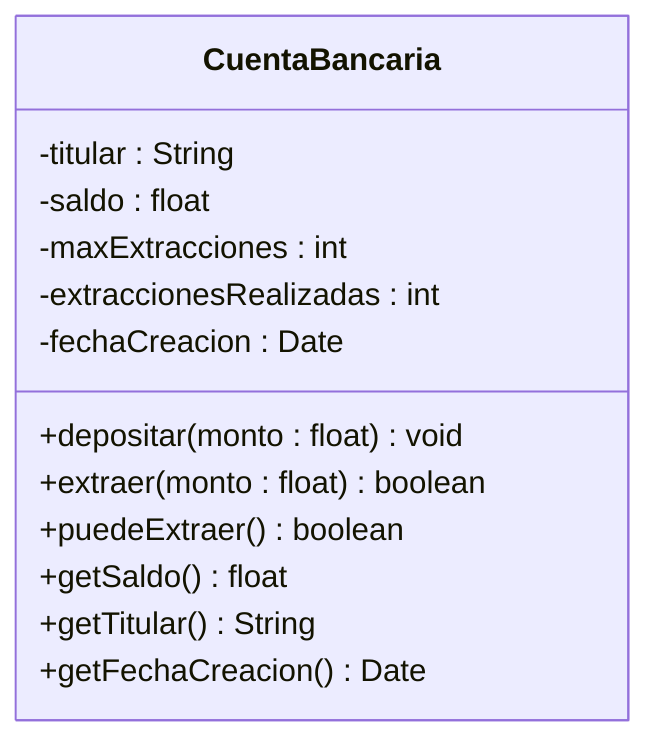
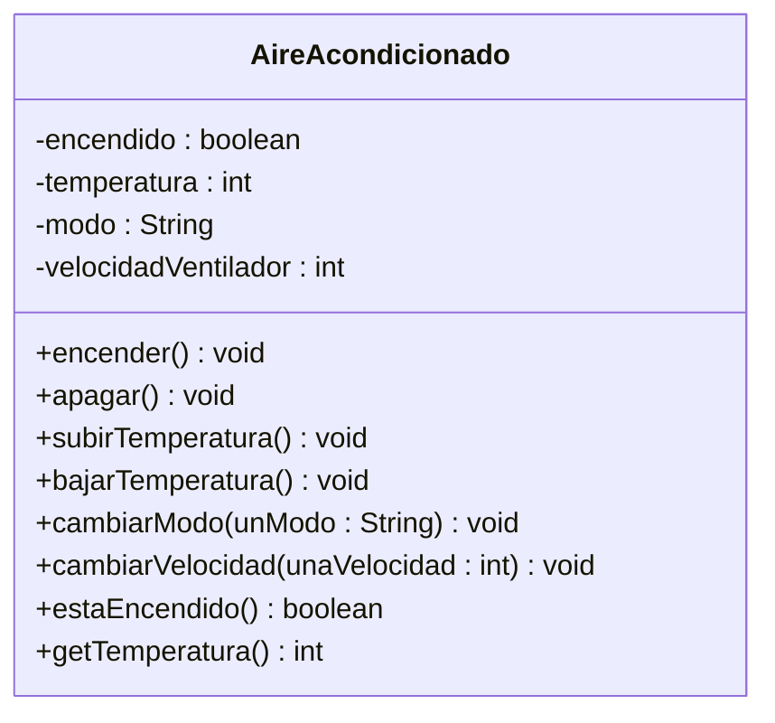
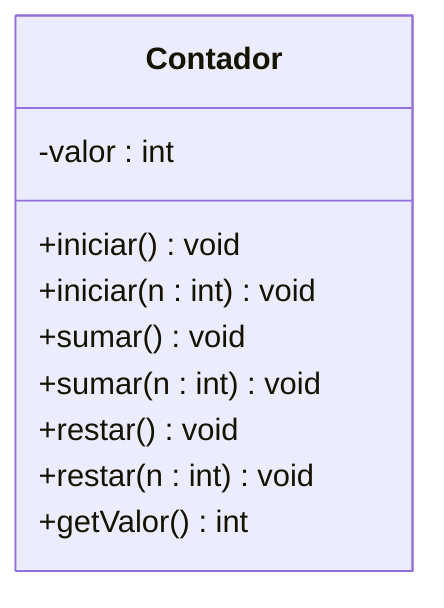
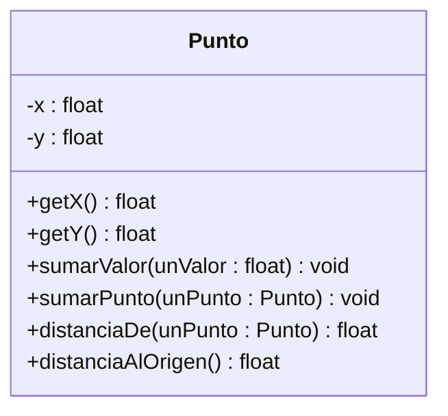
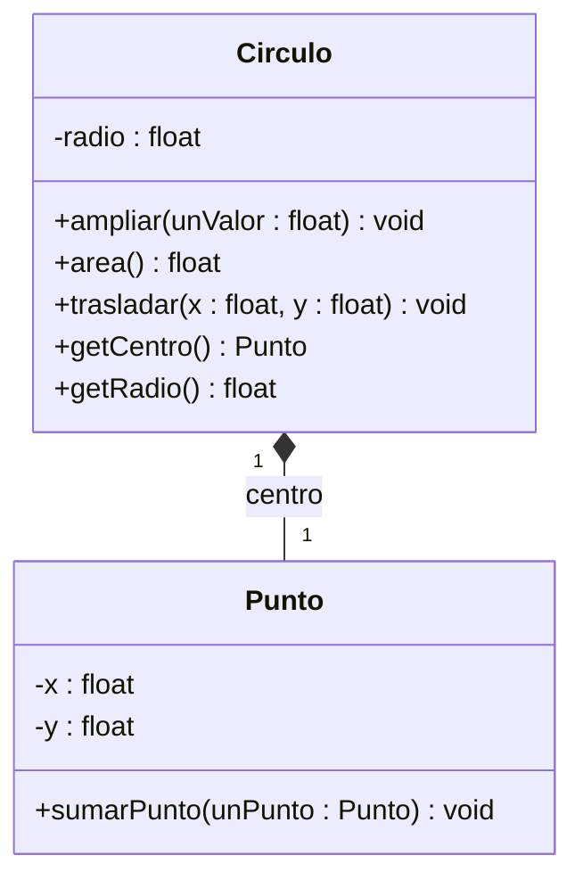
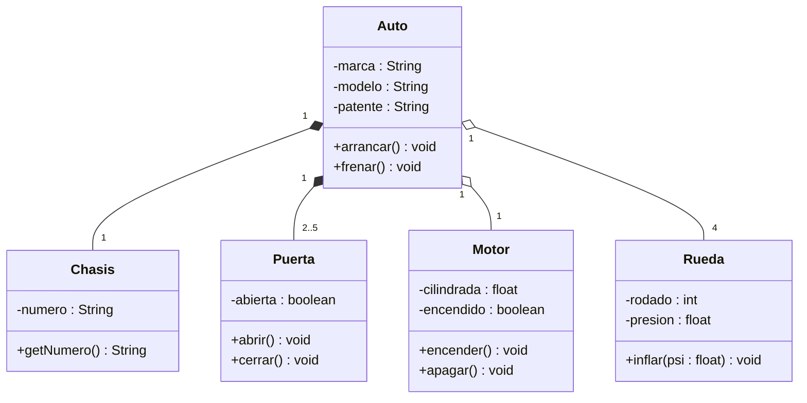
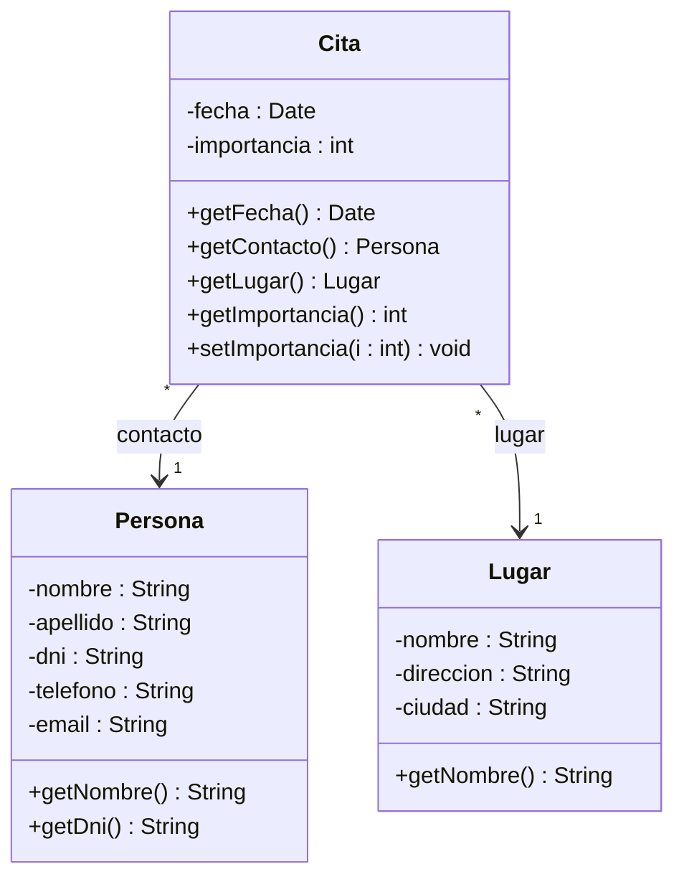
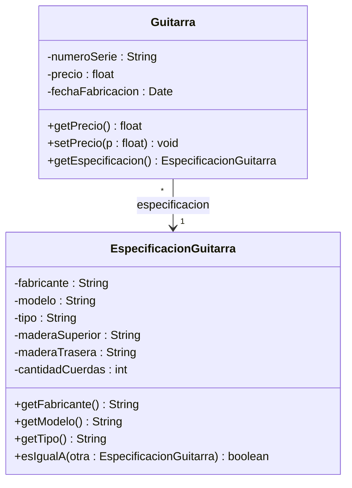
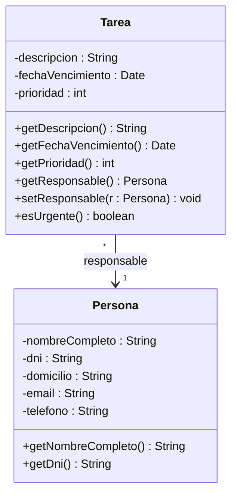
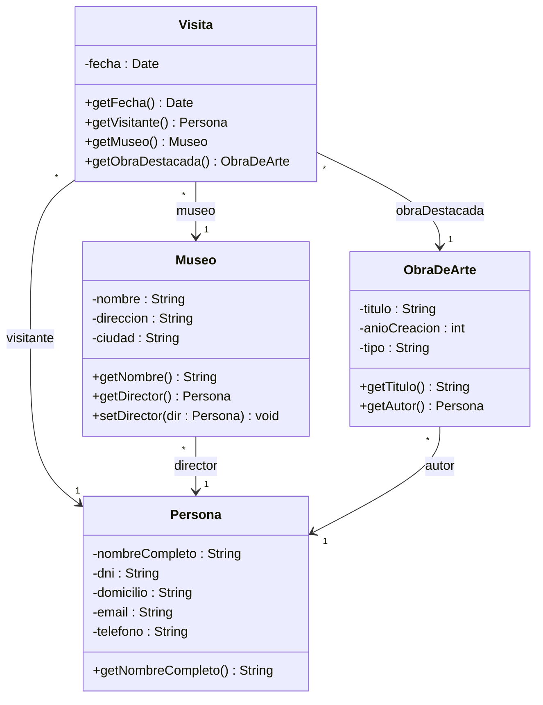

# IPOO — Diagramas UML de TP1 y TP2

## El método (igual para todos los ejercicios)

1. **Subrayar el enunciado.** Sustantivos importantes → clases o atributos. Verbos → métodos. Ej: "una *cita* tiene una *fecha*" → `Cita` es clase, `fecha` es atributo.
2. **¿Dato simple u otro objeto?** Si es texto, número o fecha → atributo dentro de la caja. Si es otra clase del modelo (`Persona`, `Lugar`) → **línea entre cajas** con el nombre del rol (así lo hace la guía de Java-Like, pág. 36: `Person` no tiene atributo "address", tiene una flecha `address` hacia `Address`).
3. **Tipos y visibilidad.** Tipos de la guía: `String`, `int`, `float`, `boolean`, `Date`. Atributos privados (`-`), métodos públicos (`+`).
4. **Formato:** atributos `- nombre : Tipo`; métodos `+ nombre(param : Tipo) : Retorno` (`void` si no devuelve nada).
5. **Relaciones:** decidir tres cosas:
   - **Tipo de línea:** asociación `──>` ("conoce a"), agregación `◇──` (la parte puede existir sola), composición `◆──` (la parte no tiene sentido sin el todo).
   - **Multiplicidad:** `1`, `*` (muchos), `2..5`.
   - **Nombre del rol:** la etiqueta de la línea (`contacto`, `centro`…).

> [!note] Getters y setters
> Puse los que tienen sentido en cada clase. Si la cátedra los pide todos, va un get y un set por atributo.

---

# TP1

## Ej 13a — Cómo se representa cada cosa en UML

| Concepto | Representación |
|---|---|
| Clase | Caja con 3 partes: nombre / atributos / métodos |
| Objeto | Caja con `nombreObjeto : Clase` subrayado y sus valores (`saldo = 500`) |
| Atributo | `- saldo : float` en la parte del medio |
| Método | `+ depositar(monto : float) : void` en la parte de abajo |
| Mensaje | Flecha de un objeto a otro con el nombre del mensaje (`depositar(100)`) |
| Secuencia | Diagrama de secuencia: objetos arriba, líneas de vida verticales punteadas, mensajes como flechas horizontales ordenadas en el tiempo de arriba hacia abajo |

## Ej 13b — CuentaBancaria



> [!note] Cómo lo pensé
> - Los cuatro atributos del enunciado salen directo. `saldo` es `float` (centavos), `fechaCreacion` es `Date`.
> - Agregué `extraccionesRealizadas`: si hay un *máximo* de extracciones, la cuenta tiene que ir contando cuántas lleva para saber cuándo frenar.
> - `extraer` devuelve `boolean` para avisar si pudo o no (sin saldo o pasado del máximo → `false`).
> - `fechaCreacion` tiene getter pero no setter: la fecha en que se abrió la cuenta no debería cambiar.
> - `titular` es `String` porque en el TP1 todavía no existe `Persona`. Más adelante podría ser una línea hacia `Persona`.

## Ej 13c — AireAcondicionado (también es TP2 Ej 2)



> [!note] Cómo lo pensé
> - Cada botón del control es un mensaje → un método.
> - Para cada botón me pregunto qué dato cambia: `encender()` cambia `encendido`, `subirTemperatura()` cambia `temperatura`. Ese dato es el atributo.
> - `encendido` es `boolean` (dos estados). `modo` es `String` ("frío", "calor", "ventilación").
> - Las reglas van en el comportamiento, no en el diagrama: `subirTemperatura()` solo sube si está encendido y no pasó de 30°.

---

# TP2

## Ej 1 — Contador



> [!note] Cómo lo pensé
> - Un solo atributo, `valor`: es lo único que el contador "recuerda".
> - Agregué `getValor()`; sin él nadie puede preguntarle cuánto lleva.

**Punto c)** Mismo nombre con distintos parámetros = **sobrecarga**. La versión sin parámetro reusa la que tiene parámetro:

```java
public void sumar() {
    this.sumar(1);      // reusa sumar(n)
}

public void iniciar() {
    this.iniciar(0);    // reusa iniciar(n)
}
```

Así la lógica está escrita una sola vez: si cambia, se cambia en un solo lugar.

## Ej 3 — Punto



> [!note] Cómo lo pensé
> - `sumarPunto` y `distanciaDe` **reciben** un `Punto` como parámetro. No es un atributo (no lo guarda, lo usa un momento), así que no hay línea.
> - `distanciaDe` calcula √((x₂−x₁)² + (y₂−y₁)²).
> - `distanciaAlOrigen()` reusa el anterior: `return this.distanciaDe(new Punto(0, 0));`

## Ej 4 — Círculo



> [!note] Cómo lo pensé
> - `radio` es un número → adentro de la caja. `centro` es un `Punto` → línea con el rol `centro`.
> - **Composición (◆)**: ese punto es el centro de *ese* círculo; sin el círculo no tiene sentido. Una asociación simple también se suele aceptar.
> - `area()` devuelve π·r².
> - `trasladar(x, y)` le delega al centro: `centro.sumarPunto(new Punto(x, y))`. El círculo no toca x e y directamente, le manda un mensaje a su centro.

## Ej 5 — Auto



> [!note] Cómo lo pensé
> La pregunta clave: **¿la parte puede existir o usarse sin el todo?**
> - **Rueda y Motor → agregación (◇):** una rueda se pasa a otro auto, un motor se cambia. Existen solos.
> - **Chasis y Puerta → composición (◆):** el número de chasis *es* la identidad del auto y la puerta está hecha para esa carrocería.
> - Multiplicidades: 4 ruedas, 2 a 5 puertas, 1 motor, 1 chasis.

## Ej 6 — Persona, Cita y Lugar



> [!note] Cómo lo pensé
> - `fecha` e `importancia` son datos simples → adentro de `Cita`. `contacto` y `lugar` son objetos → líneas que salen de `Cita` (la cita conoce a la persona y al lugar).
> - **Asociación, no composición:** la persona y el lugar siguen existiendo aunque borres la cita.
> - Multiplicidad: cada cita tiene 1 contacto, pero una persona puede estar en muchas citas (`*`). Igual con el lugar.
> - `dni` es `String`: no se hacen cuentas con él.
> - La validación de 1 a 5 va en `setImportancia`.

## Ej 7 — Guitarra



> [!note] a) ¿Cómo se hace?
> Separo lo **propio de cada guitarra física** de lo que **describe al modelo**.
> - Si hay 10 Stratocaster iguales, cada una tiene su número de serie, precio y fecha → quedan en `Guitarra`.
> - Fabricante, modelo, tipo, maderas y cuerdas son **iguales para las 10** → van a `EspecificacionGuitarra`.
> - Por eso `*` a `1`: muchas guitarras comparten una especificación.
> - `esIgualA` sirve para buscar guitarras que cumplan lo que pide un cliente.

## Ej 8 — Persona y Tarea



> [!note] Cómo lo pensé
> - Mismo patrón que el Ej 6: `responsable` es una `Persona` → línea. Una persona puede tener muchas tareas, cada tarea tiene 1 responsable.
> - `setResponsable` permite reasignar la tarea.
> - `esUrgente()` devuelve `prioridad == 5`. Es una **responsabilidad** de la tarea: ella sabe si es urgente, nadie de afuera tiene que mirar su prioridad y decidirlo.

## Ej 9 — Museos



> [!note] Cómo lo pensé
> Idea nueva: **la misma clase puede cumplir distintos roles.**
> - Hay **una sola** clase `Persona`, pero le llegan tres líneas: `visitante`, `director` y `autor`. El nombre del rol las diferencia; no hacen falta clases `Visitante`, `Director`, `Autor`.
> - `Visita` conecta todo: 1 visitante, 1 museo y 1 obra destacada.
> - Todas son asociaciones: ninguno de esos objetos depende de la visita para existir.
> - No le puse al museo una colección de obras porque el enunciado no la pide, y las colecciones (`Vector`) aparecen recién en el TP3.
